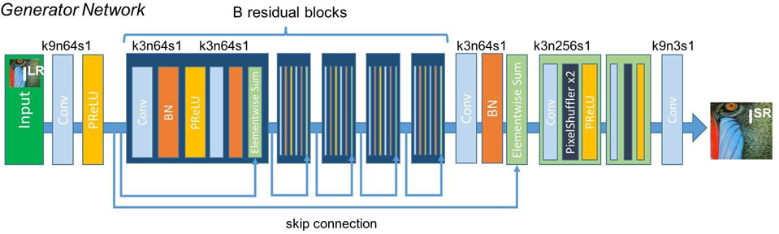
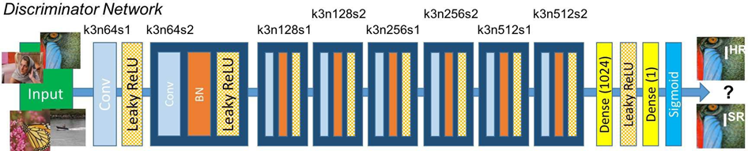
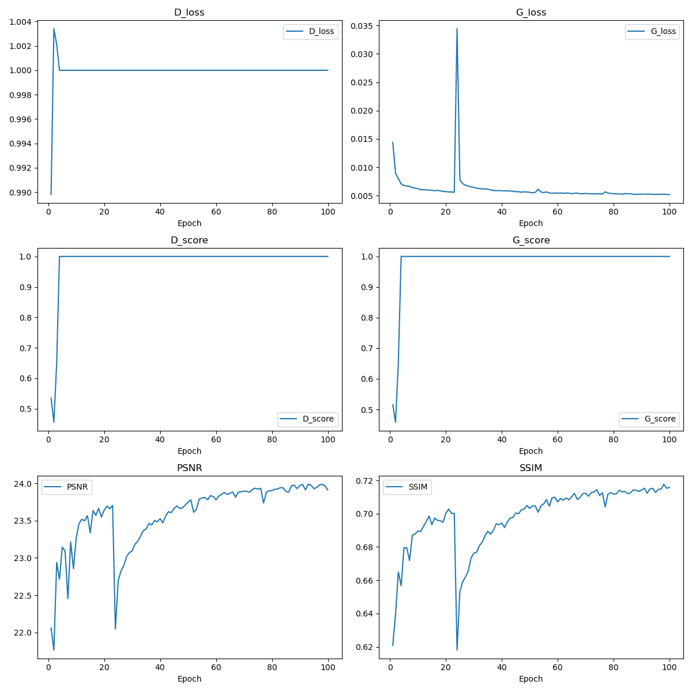
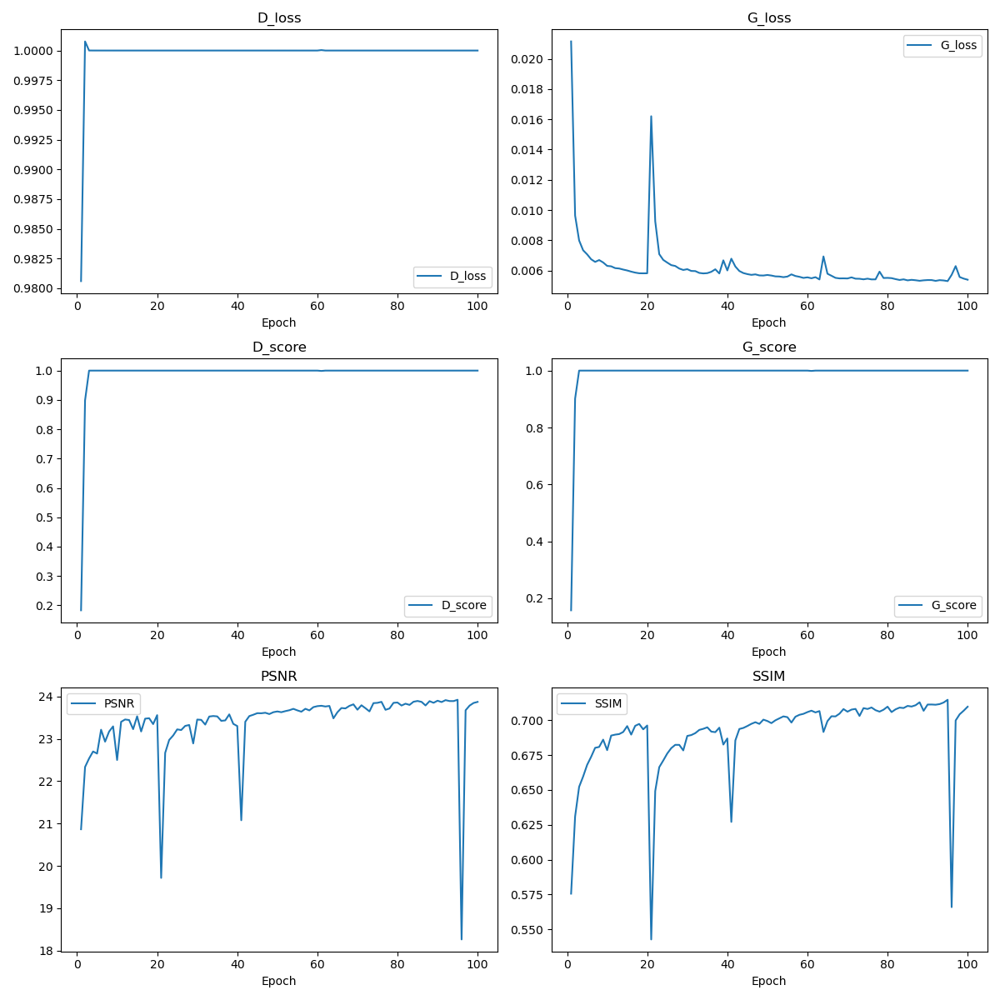

# SRGAN

This is a reproduction of SRGAN [Photo-Realistic Single Image Super-Resolution Using a Generative Adversarial Network](https://arxiv.org/abs/1609.04802).

The code I used and the dataset were referenced from [leftthomas/SRGAN: A PyTorch implementation of SRGAN based on CVPR 2017 paper "Photo-Realistic Single Image Super-Resolution Using a Generative Adversarial Network"](https://github.com/leftthomas/SRGAN)

## Summary of key information of the SRGAN paper

1. The generator structure is shown in the following figure

   

   The amplification factor of ×4 was taken, and the generator design was B=16. A total of 16 residual modules
2. The discriminator structure is as follows

   
3. The paper shows that the VGG54 loss function can effectively capture high-level details with the content loss, and the best experimental results are obtained

## Requirements

- [Anaconda](https://www.anaconda.com/download/)
- PyTorch

```
conda install pytorch torchvision -c pytorch
```

- opencv

```
conda install opencv
```

## Datasets

### Train、Val dataset

Both the training set and the validation set were sampled from VOC12, with 16,700 images in the training set and 425 images in the validation set

### Test dataset

Test datasets used include:
| **Set 5** |  [Bevilacqua et al. BMVC 2012](http://people.rennes.inria.fr/Aline.Roumy/results/SR_BMVC12.html)
| **Set 14** |  [Zeyde et al. LNCS 2010](https://sites.google.com/site/romanzeyde/research-interests)
| **BSD 100** | [Martin et al. ICCV 2001](https://www.eecs.berkeley.edu/Research/Projects/CS/vision/bsds/)
| **Urban 100** | [Huang et al. CVPR 2015](https://sites.google.com/site/jbhuang0604/publications/struct_sr).

## Usage

### Train

```
python train.py

optional arguments:
--crop_size                   training images crop size [default value is 88]
--upscale_factor              super resolution upscale factor [default value is 4](choices:[2, 4, 8])
--num_epochs                  train epoch number [default value is 100]
```

The output val super resolution images are on `training_results` directory.

### Test Benchmark Datasets

```
python test_benchmark.py

optional arguments:
--upscale_factor              super resolution upscale factor [default value is 4]
--model_name                  generator model epoch name [default value is netG_epoch_4_100.pth]
```

The output super resolution images are on `benchmark_results` directory.

### Test Single Image

```
python test_image.py

optional arguments:
--upscale_factor              super resolution upscale factor [default value is 4]
--test_mode                   using GPU or CPU [default value is 'GPU'](choices:['GPU', 'CPU'])
--image_name                  test low resolution image name
--model_name                  generator model epoch name [default value is netG_epoch_4_100.pth]
```

The output super resolution image are on the same directory.


## Output curve



This result is the case where the residual block B = 6 is used.

In addition, I tried to increase the generator residual block and adjust the training strategy so that the generator is updated every two times and the discriminator is updated.

The output curve is:


